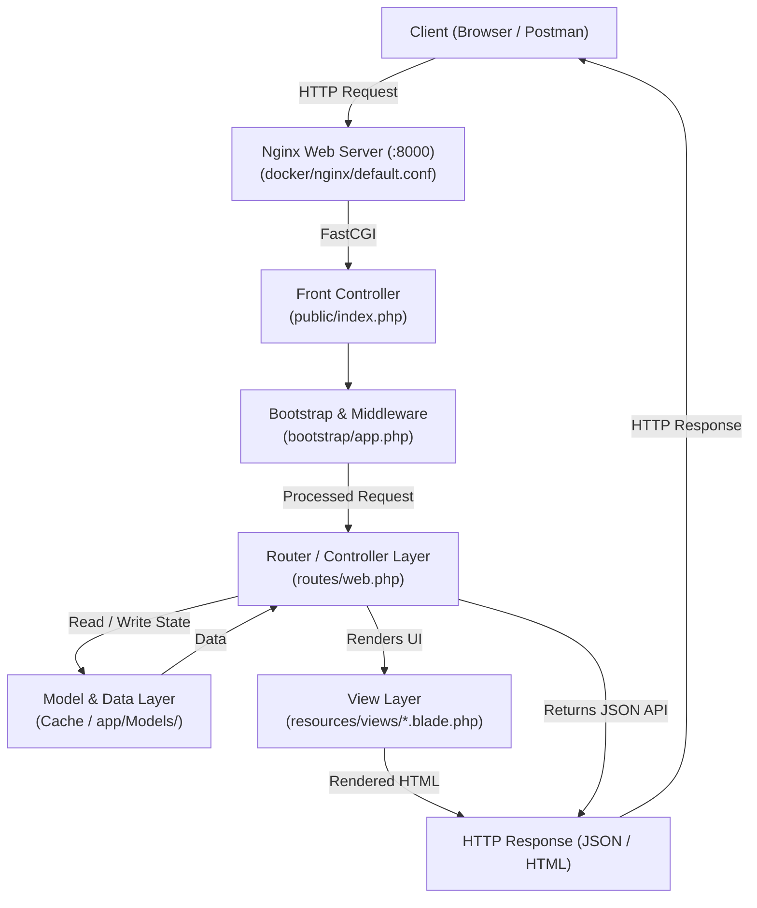

# Alumni Tracking & Community Networking System

A scalable, web-based alumni management and engagement platform designed to bridge the gap between educational institutions, organizations, students, and graduates. The system empowers communities to maintain lifelong connections, support professional growth, and foster collaborative networking.


## About the Project

Maintaining active connections with graduates is a significant challenge for many universities, academies, and professional institutions. The **Alumni Tracking System** serves as a centralized digital ecosystem where alumni can showcase their career achievements, engage with peers, mentor upcoming students, and share professional opportunities.

Built with modern web standards, this platform offers a secure, modular, and customizable foundation adaptable to any institution looking to modernize its alumni relations and career support networks.


## Technology Stack

| Layer | Technology | Purpose |
| :--- | :--- | :--- |
| **Backend Framework** | [Laravel (PHP 8.2+)](https://laravel.com/) | Robust MVC architecture, routing, security, and ORM |
| **Database** | [MySQL 8.0](https://www.mysql.com/) | Relational data persistence and optimized query performance |
| **Containerization** | [Docker](https://www.docker.com/) & Docker Compose | Consistent, reproducible development and production environments |
| **Web Server** | Nginx | High-performance reverse proxy and static asset handling |
| **API Documentation** | [Swagger / OpenAPI 3.0](https://swagger.io/) | Interactive API specification and live endpoint testing |
| **Frontend** | Blade & Modern CSS/JS | Responsive, accessible, and intuitive user interfaces |


## Core System Modules & Features

### 1. Comprehensive Profile & Portfolio Management
- **Professional Timeline:** Track employment history, current company, job titles, and industry sectors.
- **Academic Background:** Record degrees, graduation years, departments, academic honors, and certifications.
- **Skill Endorsements & Links:** Showcase core competencies alongside integrated links to LinkedIn, GitHub, and personal portfolios.
- **Privacy Controls:** Allow users to manage the visibility of their contact information and personal details.

### 2. Smart Directory & Advanced Discovery
- **Multi-Criteria Search:** Filter alumni by graduation year, department, current company, role, industry, and geographic location.
- **Interactive Directory:** Browse member profiles with quick-connect features.
- **Geographic Insights:** Discover alumni located in specific cities or countries worldwide.

### 3. Networking & Communication Hub
- **Direct Messaging:** Secure, private communication channels between registered members.
- **Discussion Channels & Announcements:** Broadcast institutional news, achievements, and community discussions.
- **Connection Requests:** Build and expand professional relationships within the verified community.

### 4. Career Hub & Opportunity Board
- **Alumni-Shared Jobs:** Enable alumni to post open positions, internships, and project collaborations from their companies.
- **Internal Referral Network:** Connect job-seeking graduates directly with alumni working in target companies.
- **Application Tracking:** Direct links to application portals and recruiter contacts.

### 5. Mentorship & Guidance Program
- **Mentor Directory:** Identify experienced alumni willing to offer career guidance, resume reviews, or mock interviews.
- **Student-Alumni Engagement:** Bridge the transition between academia and industry for graduating students.

### 6. Events & Meetup Management
- **Event Scheduling:** Host and organize reunions, webinars, panel discussions, and career fairs.
- **RSVP & Attendance Tracking:** Keep track of participant lists and send automated event notifications.

### 7. Administration, Verification & Insights
- **Account Verification:** Prevent fraudulent accounts by verifying student/diploma IDs against institutional records.
- **Role-Based Access Control (RBAC):** Distinct permission levels for Administrators, Alumni, Students, and Institutional Staff.
- **Analytics & Demographics:** Visual reporting on alumni employment rates, industry distribution, and regional density.


---

## 🏛️ MVC Architecture & Project Structure

The **Alumni Tracking System** follows the standard **Model-View-Controller (MVC)** architectural pattern provided by the Laravel framework. This architectural pattern separates application concerns into three interconnected components, ensuring maintainability, scalability, and code testability.



### 1. The Three Pillars of MVC in This Application

#### 🔹 Model (M) — Data Representation & Persistence
The Model layer represents the business data, schemas, and state management.
- **Standalone User Model (`app/Models/User.php`):** Implements complete CRUD functionality (`all()`, `find()`, `create()`, `update()`, `deleteById()`, `reset()`) without requiring an active database connection. Backed by Laravel's Cache subsystem, it encapsulates domain attributes, validation, array conversions, and auto-incrementing ID generation.
- **Target Eloquent Models (`app/Models/`):** The designated directory for data models. Once MySQL tables and migrations are integrated in future phases, models can transition to Eloquent ORM.
- **Specification Model (`app/Http/SwaggerSpec.php`):** Encapsulates the domain model for API specifications, defining data schemas, request parameters, and response structures according to the OpenAPI 3.0 standard.

#### 🔹 View (V) — Presentation Layer
The View layer is responsible for rendering content and presenting data to the user.
- **Blade Templating Engine (`resources/views/`):** Laravel's template engine combines HTML with lightweight PHP constructs.
  - `resources/views/welcome.blade.php`: The primary visual portal and landing page displaying project status, module cards, and navigation links.
  - `resources/views/about.blade.php`: Static informational page describing the institutional mission.
  - `resources/views/swagger.blade.php`: Interactive API documentation interface embedding Swagger UI v5 via CDN, allowing browser-based endpoint exploration and execution ("Try it out").
- **JSON View Layer:** For REST API endpoints (`/api/*`), views are represented as serialized JSON responses (`response()->json(...)`), providing consistent payloads with status codes (`200 OK`, `201 Created`, `404 Not Found`).

#### 🔹 Controller (C) — Request Handling & Business Logic
The Controller layer processes incoming requests, coordinates domain models, and returns formatted responses.
- **REST API Controller (`app/Http/Controllers/ApiUserController.php`):** Implements all RESTful CRUD endpoints (`index`, `store`, `show`, `update`, `destroy`, `reset`) returning structured JSON responses, handling payload normalization, and enforcing RFC-compliant PUT/PATCH behavior.
- **Web User Controller (`app/Http/Controllers/UserController.php`):** Handles web user requests and view lifecycles (`index`, `create`, `store`, `show`, `edit`, `update`, `destroy`).
- **HTTP Front Controller (`public/index.php`):** The unified entry point for all incoming web requests directed through Nginx.
- **Middleware & Kernel Configuration (`bootstrap/app.php`):** Configures application middleware, routing, and CSRF token exemption rules for API routes (`api/*`).

---

### 2. Directory, Folder & File Map

A comprehensive breakdown of all application directories, folders, and key files:

```text
alumni/
├── app/                              # Core application business logic
│   ├── Http/                         # HTTP transport layer
│   │   ├── Controllers/              # [Controller Layer] Controller classes directory
│   │   │   ├── Controller.php        # Base controller class
│   │   │   ├── UserController.php    # Web Controller with full CRUD functions
│   │   │   └── ApiUserController.php # REST API Controller with full CRUD functions
│   │   └── SwaggerSpec.php           # [Model/Spec] Centralized OpenAPI 3.0 specification definition
│   ├── Models/                       # [Model Layer] Domain data models
│   │   └── User.php                  # Database-independent User model with full CRUD functions
│   └── Providers/                    # Service providers bootstrapping core components
│
├── bootstrap/                        # Framework startup and bootstrapping
│   ├── app.php                       # [Controller Pipeline] Application initialization & middleware
│   └── cache/                        # Cached package and service provider manifests
│
├── config/                           # Application configuration files
│   ├── app.php                       # Application name, timezone, locale, and encryption key
│   ├── cache.php                     # [Model State] Cache store definitions (file cache settings)
│   ├── database.php                  # Database connection settings (MySQL, SQLite, Redis)
│   └── view.php                      # [View Config] Blade compiled views path settings
│
├── docker/                           # Containerization & infrastructure configuration
│   ├── nginx/
│   │   └── default.conf              # Nginx web server configuration and reverse proxy
│   └── php/
│       └── Dockerfile                # Custom PHP 8.2-FPM container image definition
│
├── public/                           # Web server document root (publicly exposed)
│   └── index.php                     # [Front Controller] Initial entry point for all requests
│
├── resources/                        # Presentation layer assets and templates
│   └── views/                        # [View] Blade HTML templates
│       ├── about.blade.php           # Temporary About page
│       ├── swagger.blade.php         # Interactive Swagger UI dashboard
│       └── welcome.blade.php         # Main application landing page
│
├── routes/                           # Application route definitions
│   ├── console.php                   # Artisan CLI command routes
│   └── web.php                       # [Router & Controllers] Web routes, API endpoints & logic
│
├── storage/                          # Generated files, logs, and framework cache
│   ├── framework/                    # Compiled Blade templates, cache stores, and sessions
│   └── logs/                         # Runtime log files (laravel.log)
│
├── .env / .env.example               # Environment variables configuration
├── .gitignore                        # Git version control ignore rules
├── artisan                           # Laravel Artisan CLI executable
├── composer.json / composer.lock     # PHP dependencies, autoloading, and package lock
├── docker-compose.yml                # Multi-container orchestration (App, Web Server, DB)
└── README.md                         # Project documentation and developer reference
```


---

## Getting Started with Docker

### Prerequisites
- [Docker](https://www.docker.com/) (version 20.10 or later)
- [Docker Compose](https://docs.docker.com/compose/)

### 1. Clone the Repository
```bash
git clone https://github.com/DilaraMUMCU/alumni.git
cd alumni
```

### 2. Start the Containers
```bash
docker compose up -d --build
```


## API Documentation (Swagger)

Once the application is running, you can access the interactive API documentation via your browser:

- **Swagger UI:** [http://localhost:8000/api/swagger](http://localhost:8000/api/swagger)
- **Raw OpenAPI JSON:** [http://localhost:8000/api/swagger.json](http://localhost:8000/api/swagger.json)
